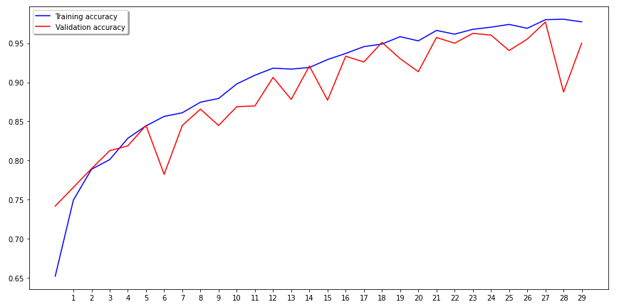
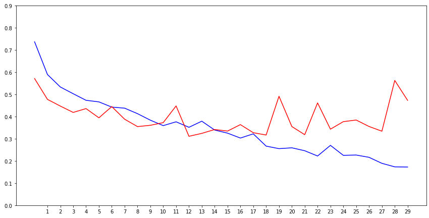

# How to run this code?
1. Download Dataset & copy your dataset to your Project Directory
2. Open this project as root in Python IDE
3. Install requirements.txt```pip install -r requirements.txt```
4. Uncomment this conntent


5. execute ```main.py``` to run the augmented images


# Link Dataset
[click to Download](https://drive.google.com/file/d/1HAeCIBUdCby4vkyT4E5L2yqxG_tiJx50/view?usp=sharing)

if you have downloaded it, you will see the directory arrangement like this :


### Augmented Images Test
Test: accuracy = 0.833333  ;  loss = 0.429308




### Normal Image Test
Test: accuracy = 0.812500  ;  loss = 0.488956 

